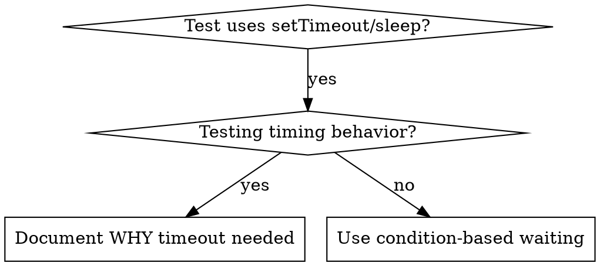

# 基于条件的等待

## 概述

不稳定测试经常使用任意延迟来猜测时序。这会产生竞态条件：测试在快速机器上通过，却在高负载或 CI 环境中失败。

**核心原则：等待真正关心的条件成立，不要猜测它需要多长时间。**

## 何时使用



**在以下情形使用：**

- 测试包含任意延迟（`setTimeout`、`sleep`、`time.sleep()`）。
- 测试不稳定（有时通过，在负载下失败）。
- 测试并行运行时超时。
- 等待异步操作完成。

**在以下情形不要使用：**

- 正在测试真实时序行为（debounce、throttle 间隔）。
- 使用任意超时时，始终记录为何需要它。

## 核心模式

```typescript
// ❌ 修改前：猜测时序
await new Promise(r => setTimeout(r, 50));
const result = getResult();
expect(result).toBeDefined();

// ✅ 修改后：等待条件
await waitFor(() => getResult() !== undefined);
const result = getResult();
expect(result).toBeDefined();
```

## 常用模式

| 场景 | 模式 |
|---|---|
| 等待事件 | `waitFor(() => events.find(e => e.type === 'DONE'))` |
| 等待状态 | `waitFor(() => machine.state === 'ready')` |
| 等待数量 | `waitFor(() => items.length >= 5)` |
| 等待文件 | `waitFor(() => fs.existsSync(path))` |
| 复杂条件 | `waitFor(() => obj.ready && obj.value > 10)` |

## 实现

通用轮询函数：

```typescript
async function waitFor<T>(
  condition: () => T | undefined | null | false,
  description: string,
  timeoutMs = 5000
): Promise<T> {
  const startTime = Date.now();

  while (true) {
    const result = condition();
    if (result) return result;

    if (Date.now() - startTime > timeoutMs) {
      throw new Error(`Timeout waiting for ${description} after ${timeoutMs}ms`);
    }

    await new Promise(r => setTimeout(r, 10)); // 每 10ms 轮询一次
  }
}
```

完整实现见本目录中的 `condition-based-waiting-example.ts`，其中包含来自真实调试会话的领域专用辅助函数（`waitForEvent`、`waitForEventCount`、`waitForEventMatch`）。

## 常见错误

**❌ 轮询太快：** `setTimeout(check, 1)`——浪费 CPU。  
**✅ 修复：**每 10ms 轮询一次。

**❌ 没有超时：**条件永不满足时无限循环。  
**✅ 修复：**始终设置超时，并提供清晰错误。

**❌ 数据过时：**在循环前缓存状态。  
**✅ 修复：**在循环内调用 getter，以获取最新数据。

## 何时应使用任意超时

```typescript
// 工具每 100ms tick 一次——需要等待两个 tick 来验证部分输出
await waitForEvent(manager, 'TOOL_STARTED'); // 首先：等待条件
await new Promise(r => setTimeout(r, 200));  // 然后：等待定时行为
// 200ms = 两个 100ms 间隔的 tick——已记录并有明确依据
```

**要求：**

1. 先等待触发条件。
2. 基于已知时序，而不是猜测。
3. 使用注释解释原因。

## 实际影响

来自一次调试会话（2025-10-03）：

- 修复了 3 个文件中的 15 个不稳定测试。
- 通过率：60% → 100%。
- 执行时间缩短 40%。
- 不再出现竞态条件。
