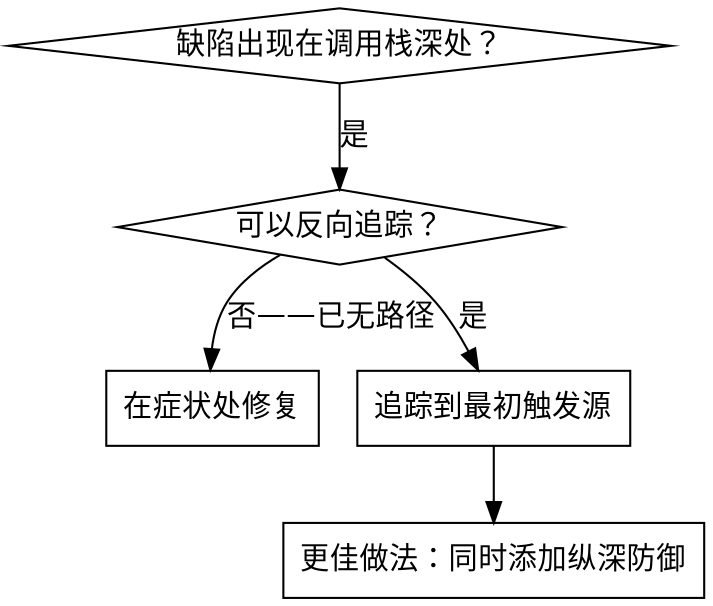
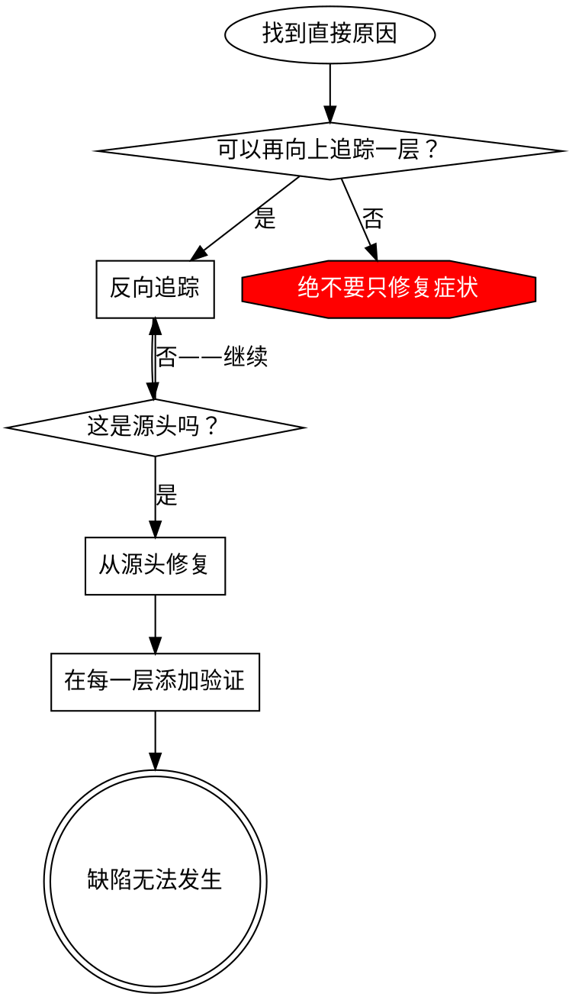

# 根因追踪

## 概述

缺陷经常在调用栈深处表现出来（在错误目录执行 git init、在错误位置创建文件、使用错误路径打开数据库）。本能反应是在错误出现之处修复，但这只是在处理症状。

**核心原则：**沿调用链反向追踪，直到找到最初触发源，然后从源头修复。

## 适用场景



**适用于：**
- 错误发生在执行深处（不在入口点）
- Stack trace 显示很长的调用链
- 不清楚无效数据来自哪里
- 需要找出触发问题的测试/代码

## 追踪过程

### 1. 观察症状
```
Error: git init failed in /Users/jesse/project/packages/core
```

### 2. 找到直接原因
**哪段代码直接造成问题？**
```typescript
await execFileAsync('git', ['init'], { cwd: projectDir });
```

### 3. 追问：谁调用了它？
```typescript
WorktreeManager.createSessionWorktree(projectDir, sessionId)
  → 由 Session.initializeWorkspace() 调用
  → 由 Session.create() 调用
  → 由 Project.create() 处的测试调用
```

### 4. 继续向上追踪
**传入了什么值？**
- `projectDir = ''`（空字符串！）
- 空字符串作为 `cwd` 时会解析为 `process.cwd()`
- 那正是源码目录！

### 5. 找到最初触发源
**空字符串来自哪里？**
```typescript
const context = setupCoreTest(); // 返回 { tempDir: '' }
Project.create('name', context.tempDir); // 在 beforeEach 前访问！
```

## 添加 Stack Trace

无法手工追踪时，添加插桩：

```typescript
// 在有问题的操作前
async function gitInit(directory: string) {
  const stack = new Error().stack;
  console.error('DEBUG git init:', {
    directory,
    cwd: process.cwd(),
    nodeEnv: process.env.NODE_ENV,
    stack,
  });

  await execFileAsync('git', ['init'], { cwd: directory });
}
```

**关键：**测试中使用 `console.error()`（不要使用 logger——它可能不会显示）

**运行并捕获：**
```bash
npm test 2>&1 | grep 'DEBUG git init'
```

**分析 stack traces：**
- 查找测试文件名
- 找到触发调用的行号
- 识别规律（同一个测试？同一个参数？）

## 找出造成污染的测试

如果测试期间出现某项内容，但不知道由哪个测试造成：

使用本目录中的二分脚本 `find-polluter.sh`：

```bash
./find-polluter.sh '.git' 'src/**/*.test.ts'
```

它会逐个运行测试，并在发现第一个污染源时停止。用法详见脚本。

## 真实示例：空 projectDir

**症状：**在 `packages/core/`（源码）中创建了 `.git`

**追踪链：**
1. `git init` 在 `process.cwd()` 中运行 ← cwd 参数为空
2. WorktreeManager 收到空 projectDir
3. Session.create() 传入空字符串
4. 测试在 beforeEach 前访问 `context.tempDir`
5. setupCoreTest() 最初返回 `{ tempDir: '' }`

**根因：**顶层变量初始化时访问了空值

**修复：**将 tempDir 改为 getter，在 beforeEach 前访问时抛出错误

**同时添加纵深防御：**
- 第 1 层：Project.create() 验证目录
- 第 2 层：WorkspaceManager 验证非空
- 第 3 层：NODE_ENV 防护拒绝在 tmpdir 之外执行 git init
- 第 4 层：git init 前记录 stack trace

## 核心原则



**绝不要只在错误出现之处修复。**反向追踪，找到最初触发源。

## Stack Trace 提示

**测试中：**使用 `console.error()`，不要使用 logger——logger 可能被抑制
**操作前：**在危险操作前记录日志，不要等失败后再记录
**包含上下文：**目录、cwd、环境变量、时间戳
**捕获栈：**`new Error().stack` 会显示完整调用链

## 真实影响

来自调试会话（2025-10-03）：
- 通过 5 层追踪找到根因
- 从源头修复（getter 验证）
- 添加 4 层防御
- 1847 项测试通过，零污染
