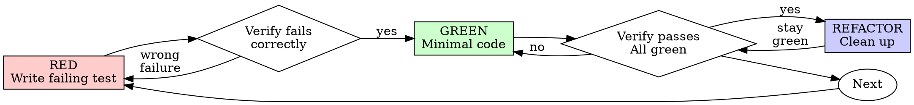

# 测试驱动开发 (TDD)

## 概述

先写测试。看着它失败。编写最少的代码即可通过。

**核心原则：** 如果你没有看到测试失败，你就不知道它是否测试了正确的东西。

**它是服务于交付的强力默认方案，而不是凌驾于交付之上的铁律。** TDD 的价值在于：失败测试能锁定那些容易实现错误的行为，例如核心逻辑、契约和棘手边界情况。应根据风险选用——在测试优先确实能降低变更风险时使用；一次性原型、单行文案调整和显而易见的胶水代码不需要这套仪式。不要用换个说法来逃避它，也不要让它阻碍真正可用的成果交付。

## 何时使用

**当回归风险值得采用测试优先时，对选定行为使用它：**
- 新功能
- 错误修复
- 重构
- 行为改变

**以下工作应选择与风险相称的验证方式：**
- 一次性原型
- 生成的代码
- 配置文件

先确定任务选用的 project/mission/slice 流程。如果该范围明确要求 TDD，这一步仍然必须执行；要变更它，需要得到该流程指定的授权。在此之外，应选择真正能检测失败的验证方式，而无需额外增加人工审批仪式。下文说明的是选择 TDD 时的流程，而不是所有工作的统一完成门槛。

**切分粒度应服从成果。** 针对正在改变的行为保持红 → 绿 → 重构，并形成一个连贯的工作单元。TDD 不要求两个人协作，也不要求编辑前许可或守门人；独立性和审查节奏来自所选的 project/mission/slice 组件或 wave。显式选定的门禁仍然有效；未被选定的角色无权另加门禁。


## 选定行为的测试优先契约
```
Selected TDD behavior: observe the expected failure before implementing the fix.
```
已经写好实现了吗？保留现有内容以及他人的修改。可在隔离副本中建立失败基线，或仅以可逆方式暂时移开自己拥有的变更，再从行为测试开始实现。本 skill 不授予删除代码的权限。如果无法证明失败基线，请记录这一限制并遵循所选流程；不要把事后补测试称作 TDD。

## 红绿重构

### RED——编写失败测试

编写一个最小测试，说明预期行为。

<Good>
```typescript
test('retries failed operations 3 times', async () => {
  let attempts = 0;
  const operation = () => {
    attempts++;
    if (attempts < 3) throw new Error('fail');
    return 'success';
  };

  const result = await retryOperation(operation);

  expect(result).toBe('success');
  expect(attempts).toBe(3);
});
```
名称清晰，只测试一件真实行为
</Good>

<Bad>
```typescript
test('retry works', async () => {
  const mock = jest.fn()
    .mockRejectedValueOnce(new Error())
    .mockRejectedValueOnce(new Error())
    .mockResolvedValueOnce('success');
  await retryOperation(mock);
  expect(mock).toHaveBeenCalledTimes(3);
});
```
名称模糊，测试的是 mock 而非真实代码
</Bad>

**要求：**
- 一项行为
- 名称清晰
- 使用真实代码（除非无法避免，否则不使用 mock）

### 验证 RED——观察它失败

**需要在选定的 TDD 周期中建立 RED。**
```bash
npm test path/to/test.test.ts
```
确认：
- 测试因断言不满足而失败，而不是执行报错
- 失败消息符合预期
- 失败原因是功能尚未实现，而不是拼写错误

**测试通过？** 您正在测试现有行为。修复测试。

**测试错误？** 修复错误，重新运行，直到正确失败。

### GREEN——最小实现

编写能让测试通过的最简单代码。

<Good>
```typescript
async function retryOperation<T>(fn: () => Promise<T>): Promise<T> {
  for (let i = 0; i < 3; i++) {
    try {
      return await fn();
    } catch (e) {
      if (i === 2) throw e;
    }
  }
  throw new Error('unreachable');
}
```
只要够通过即可
</Good>

<Bad>
```typescript
async function retryOperation<T>(
  fn: () => Promise<T>,
  options?: {
    maxRetries?: number;
    backoff?: 'linear' | 'exponential';
    onRetry?: (attempt: number) => void;
  }
): Promise<T> {
  // YAGNI
}
```
过度设计
</Bad>

不要添加功能、重构其他代码或在测试之外进行“改进”。

### 验证 GREEN——观察它通过

**需要在选定的 TDD 周期中建立绿色。**
```bash
npm test path/to/test.test.ts
```
确认：
- 测试通过
- 其他测试仍然通过
- 输出干净（没有错误或警告）

**测试失败？** 修复代码，而不是测试。

**其他测试失败？** 立即修复。

### REFACTOR——清理代码

仅绿色之后：
- 删除重复项
- 改进名称
- 提取助手

保持测试绿色。不要添加行为。

### 重复

为下一项行为编写下一个失败测试。

## 良好的测试

| 质量 | 好 | 差 |
|---------|------|-----|
| **最小** | 只测一件事。名称里有“并且”？拆开它。 | `test('validates email and domain and whitespace')` |
| **清晰** | 名称准确描述行为 | `test('test1')` |
| **体现意图** | 展示期望的 API | 模糊代码应有的行为 |

## 为什么顺序很重要

**“我会在之后编写测试来验证它是否有效”**

代码写完后才补的测试会立即通过，而立即通过不能证明什么：
- 可能测错了对象
- 可能测的是实现细节，而不是行为
- 可能漏掉你没有想到的边界情况
- 你从未亲眼看到它抓住 bug

测试优先迫使你看到测试失败，从而证明它确实能检出问题。

**“我已经手动测试了所有边缘情况”**

手动测试是临时性的。你以为自己测试了所有内容，但：
- 没有测试内容的记录
- 代码更改时无法重新运行
- 在压力下很容易遗漏情况
- “我试过时能用”并不等于全面覆盖

自动化测试是系统性的，每次都以相同方式运行。

**“我已经花了 X 个小时来实施”**

投入的时间不能证明行为正确。保留已有工作，并证明测试能够在不包含本次变更的基线上检测出缺失行为；随后再用它验证实现。应如实报告实际执行顺序。

**“TDD是教条主义，务实意味着适应”**

TDD 很务实：
- 在提交前发现 bug（比事后调试更快）
- 防止回归（测试能立即捕获破坏）
- 记录行为（测试展示代码用法）
- 支持重构（可以放心修改，测试会捕获破坏）

所谓“务实”的捷径，往往等于去生产环境调试，最终更慢。

**“事后测试也能达到相同目标，重要的是精神而不是仪式”**

不。事后测试回答“它现在做什么？”，测试优先回答“它应该做什么？”。

事后测试会受到实现偏见影响：你测试的是自己已经构建的内容，而不是需求真正要求的内容；验证的是你还记得的边界情况，而不是在实现前发现的边界情况。

测试优先迫使你在实现前发现边界情况；事后测试只能验证你是否记住了全部情况，而通常并没有。

实现后再花 30 分钟补测试并不等于 TDD。你获得了覆盖率，却失去了“测试确实能发现问题”的证据。

## 常见的合理化

这些质疑适用于已经选择 TDD 的工作，而不是对选择其他验证方式的授权决定提出异议。

| 借口 | 事实 |
|--------|---------|
| “太简单了，没必要测试” | 仅仅简单，并不能免除已经选定的行为检查。 |
| “我会在之后补测试” | 测试一开始就通过，不能证明它能发现问题。 |
| “事后测试能达到相同目标” | 事后测试回答“它做了什么？”，测试优先回答“它应该做什么？”。 |
| “已经手动测试过” | 临时测试不等于系统测试：没有记录，也无法可靠重跑。 |
| “已经投入 X 小时” | 投入时间不是证据；保留工作并证明失败基线。 |
| “把现有实现当参考，先写测试” | 从实现反推测试容易复制实现中的假设；应使用需求行为和失败基线。 |
| “需要先探索” | 将探索与实现分开，理解行为后再开始选定的 TDD 循环。 |
| “测试很难 = 设计不清楚” | 倾听测试给出的反馈。难测试通常也意味着难使用。 |
| “TDD 会拖慢速度” | TDD 通常比事后调试更快。务实意味着测试优先。 |
| “手动测试更快” | 手动测试不能持续证明边界情况；每次变更都要重新测试。 |
| “现有代码没有测试” | 你正在改进它；为现有行为添加测试。 |

## 选定的 TDD 工作中的危险信号

- 测试前的代码
- 实施后测试
- 测试立即通过
- 无法解释测试失败的原因
- “稍后”添加的测试
- 合理化“就这一次”
- “我已经手动测试过了”
- “达到相同目的后进行测试”
- “这是精神而不是仪式”
- “保留作为参考”或“改编现有代码”
- “已经花了 X 小时，所以验证可以等待”
- “TDD 很教条，我很务实”
- “这是不同的，因为......”

检查声称的 RED → GREEN 顺序是否真的发生过。若证据缺失，按上面的保留规则补齐；这些危险信号从不授权删除已有工作。

## 示例：错误修复

**Bug：** 接受空 email

**RED**
```typescript
test('rejects empty email', async () => {
  const result = await submitForm({ email: '' });
  expect(result.error).toBe('Email required');
});
```
**验证 RED**
```bash
$ npm test
FAIL: expected 'Email required', got undefined
```
**GREEN**
```typescript
function submitForm(data: FormData) {
  if (!data.email?.trim()) {
    return { error: 'Email required' };
  }
  // ...
}
```
**验证 GREEN**
```bash
$ npm test
PASS
```
**重构**
如果需要，提取多个字段的验证。

## 验证清单

在声明所选 TDD 工作完成之前：

- [ ] 测试涵盖选定的行为结果
- [ ] 在实施之前观察每个测试的失败
- [ ] 每个测试均因预期原因而失败（功能缺失，而非拼写错误）
- [ ] 编写最少的代码来通过每个测试
- [ ] 所有测试均通过
- [ ] 输出干净（没有错误或警告）
- [ ] 测试使用真实代码（仅在不可避免时才进行模拟）
- [ ] 涵盖边缘情况和错误

未满足的选定检查必须保持可见。应完成它，或获取所选流程要求的处置决定；不要把这份清单变成未选择 TDD 工作的额外门禁，也不要为让历史看起来符合测试优先而删除代码。

## 当卡住时

|问题 |解决方案 |
|---------|----------|
|不知道如何测试 |首先写入所需的 API 和断言。如果行为不清楚，请咨询相关同事或工作负责人。 |
|测试太复杂|设计太复杂了。简化界面。 |
| 必须 mock 一切 | 代码耦合过强。使用依赖注入。 |
| 测试准备工作庞大 | 提取辅助函数。仍然复杂？简化设计。 |

## 调试集成

对于选定 TDD 范围内的 bug，先编写一个失败测试来复现它，再遵循 TDD 循环证明修复并防止回归。

在该范围之外，选择与风险相称的回归检查并保留证据。

## 测试反模式

添加模拟或测试实用程序时，请阅读 @testing-anti-patterns.md 以避免常见陷阱：
- 测试 mock 的行为而不是真实代码行为
- 将仅测试方法添加到生产类中
- 在不了解依赖关系的情况下进行模拟

## 最终规则
```
Selected TDD behavior → test exists and failed first
Otherwise → do not claim a test-first sequence
```
遵守显式选定的门禁及其决策 owner。本 skill 不会额外增加通用人工许可步骤、删除权限，也不会为未选择 TDD 的工作设置门禁。
